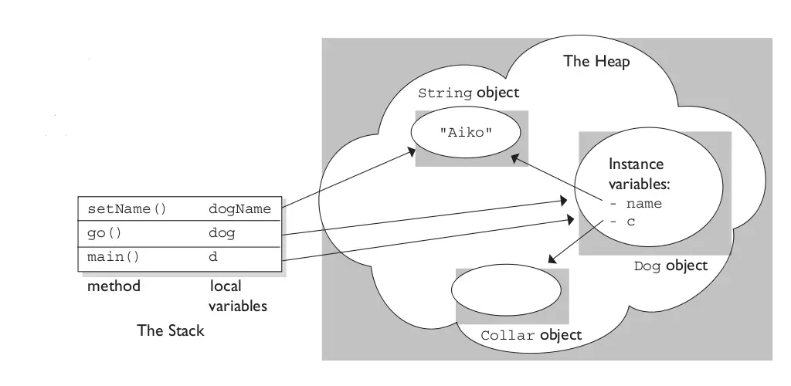

# Heap and Stack
The heap here is different from the heap list below as Heap VS PQ
Heap -- First In First Out
Stack -- First In Last Out

Stack is faster than Heap.
Heap is dynamically allocated which gives the user flexibility on it.
OS will create stack for OS threads. Heap was created by applications.





# Heap && Priority Queue

## Python:
In Python, heappop will pop out the smallest element from the heap. Accordingly pop will pop out the smallest element from
the priority queue.

### Heap:
```
import heapq
# initializing list 
li = [6, 7, 9, 3, 5, 8, 10, 1] 
  
# using heapify to convert list into heap 
heapq.heapify(li) 
  
# printing created heap 
print ("The created heap is : ",end="") 
print (list(li)) 
  
# using heappush() to push elements into heap 
# pushes 4 
heapq.heappush(li,4) 
  
# printing modified heap 
print ("The modified heap after push is : ",end="") 
print (list(li)) 
  
# using heappop() to pop smallest element 
print ("The popped and smallest element is : ",end="") 
print (heapq.heappop(li)) 

# using nlargest to print 3 largest numbers 
# prints 10, 9 and 8 
print("The 3 largest numbers in list are : ",end="") 
print(heapq.nlargest(3, li1)) 
  
# using nsmallest to print 3 smallest numbers 
# prints 1, 3 and 4 
print("The 3 smallest numbers in list are : ",end="") 
print(heapq.nsmallest(3, li1)) 
```
### Priority Queue
When we wanted to check if the priority queue is empty or not, we need to use q.qsize() > 0.
```
# Initialize Priority Queue
from Queue import PriorityQueue
q = PriorityQueue()
q.put(3)
q.put(5)
q.put(4)
# It will output the smallest element of the priority queue
print(q.get())
```

## C++
In C++, both heap and priority queue will pop out the largest element first.
### Heap
```
#include<iostream> 
#include<algorithm> // for heap operations 
using namespace std; 
int main() 
{ 
      
    // Initializing a vector 
    vector<int> v1 = {20, 30, 40, 25, 15}; 
      
    // Converting vector into a heap 
    // using make_heap() 
    make_heap(v1.begin(), v1.end()); 
      
    // Displaying the maximum element of heap 
    // using front() 
    cout << "The maximum element of heap is : "; 
    cout << v1.front() << endl; 
      
    return 0; 
} 
```
### Priority Queue
```
#include <queue>
int main () 
{ 
    priority_queue <int> gquiz; 
    gquiz.push(10); 
    gquiz.push(30); 
    gquiz.push(20); 
    gquiz.push(5); 
    gquiz.push(1); 
    // output of the code below is 30.
    cout << "The priority queue gquiz is : " << gquiz.top() << endl; 

    return 0; 
}  
```

### max_heap -- priority_queue
```
vector<int> nums;
priority_queue<int> pq(nums.begin(), nums.end());
```
### min_heap -- priroity_queue
```
vector<int> nums;
priority_queue<int, vector<int>, greater<int>> pq;
for(auto& num:nums)
{
    pq.push(num);
}
```
