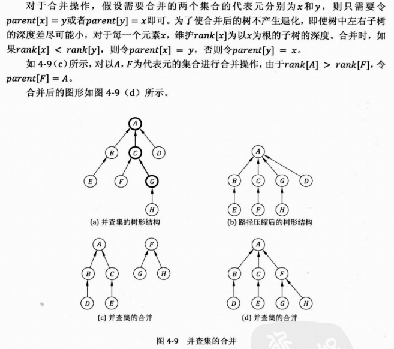

# Union find in Python

self.rank:
the parameter to show each node its ranking. It reflect the level of each node connected to the tree.
Each time we do a union, we need to find the parent of the vertice first.

self.parent:
The root of the chain for each node.


```

class Union_Find(object):
    def __init__(self, N):
        
        self.rank = [0] * (N + 1)
        self.parents = [i for i in range(N + 1)]
        
    def find(self, x):
        if x != self.parents[x]:
            return self.find(self.parents[x])
        return self.parents[x]
        
    def union(self, x, y):
        px, py = self.find(x), self.find(y)
        if px == py:
            return False
        if self.rank(px) == self.rank(py):
            self.parent(py) = px
            self.rank(px) += 1
        elif self.rank(px) > self.rank(py):
            self.parent(py) = px
        else:
            self.parent(px) = py
        return True
```
        
            
# Union Find in C++

##算法
用集合中的某个元素来代表这个集合，该元素称为集合的代表元。
一个集合内的所有元素组织成以代表元为根的树形结构。
对于每一个元素 parent[x]指向x在树形结构上的父亲节点。如果x是根节点，则令parent[x] = x。
对于查找操作，假设需要确定x所在的的集合，也就是确定集合的代表元。可以沿着parent[x]不断在树形结构中向上移动，直到到达根节点。

判断两个元素是否属于同一集合，只需要看他们的代表元是否相同即可。
路径压缩
 为了加快查找速度，查找时将x到根节点路径上的所有点的parent设为根节点，该优化方法称为压缩路径。
 
 使用该优化后，平均复杂度可视为Ackerman函数的反函数，实际应用中可粗略认为其是一个常数。
##用途
1、维护无向图的连通性。支持判断两个点是否在同一连通块内，和。
2、判断增加一条边是否会产生环：用在求解最小生成树的Kruskal算法里。

reference
《ACM国际大学生程序设计竞赛 知识与入门 俞勇主编》

三个操作
一般来说，一个并查集一三个操作。

初始化
包括对所有单个的数据建立一个单独的集合（即根据题目的意思自己建立的最多可能有的集合，为下面的合并查找操作提供操作对象）
在每一个单个的集合里面，有三个东西。
1，集合所代表的数据。（这个初始值根据需要自己定义，不固定）
2，这个集合的层次通常用rank表示（一般来说，初始化的工作之一就是将每一个集合里的rank置为0）。
3，这个集合的类别parent（有的人也喜欢用set表示）（其实就是一个指针，用来指示这个集合属于那一类，合并过后的集合，他们的parent指向的最终值一定是相同的。）
（**有的简单题里面集合的数据就是这个集合的标号，也就是说只包含2和3，1省略了）。
初始化的时候，一个集合的parent都是这个集合自己的标号。没有跟它同类的集合，那么这个集合的源头只能是自己了。
（最简单的集合就只含有这三个东西了，当然，复杂的集合就是把3指针这一项添加内容，如PKU食物链那题，我们还可以添加enemy指针，表示这个物种集合的天敌集合；food指针，表示这个物种集合的食物集合。随着指针的增加，并查集操作起来也变得复杂，题目也就显得更难了）

结构体表示法
有的人是建立一个结构体把集合表示出来，如：
```
#define MAX 10000
struct Node
{
    int data;
    int rank;
    int parent;
 }node[MAX];
 ```
数组表示法
有的人则是弄很多相同大小的数组，如：
```
int set[max];//集合index的类别，或者用parent表示
int rank[max];//集合index的层次，通常初始化为0
int data[max];//集合index的数据类型

//初始化集合
void Make_Set(int i)
{
    set[i]=i;//初始化的时候，一个集合的parent都是这个集合自己的标号。没有跟它同类的集合，那么这个集合的源头只能是自己了。
    rank[i]=0;
}
```
一般来说，题目简单用数组，题目复杂用结构体，因为结构体有条理，数组可以少打几个字。    
查找函数
就是找到parent指针的源头，可以把函数命名为get_parent（或者find_set，这个随你喜欢，以便于理解为主）
如果集合的parent等于集合的编号（即还没有被合并或者没有同类），那么自然返回自身编号。
如果不同（即经过合并操作后指针指向了源头（合并后选出的rank高的集合））那么就可以调用递归函数，如下面的代码：
```
/**
*查找集合i（一个元素是一个集合）的源头（递归实现）。
 如果集合i的父亲是自己，说明自己就是源头，返回自己的标号；
 否则查找集合i的父亲的源头。
**/
int get_parent(int x)
{
    if(node[x].parent==x)
        return x;
    return get_parent(node[x].parent);
}
```
数组的话就是：

```
//查找集合i（一个元素是一个集合）的源头（递归实现）
int Find_Set(int i)
{ 
    //如果集合i的父亲是自己，说明自己就是源头，返回自己的标号
   if(set[i]==i)
       return set[i];
    //否则查找集合i的父亲的源头
    return  Find_Set(set[i]);        
}

int unifind(int a){// find the root and compress the path
    
    int root = a;
    
    //find the root
    while(root != parent[root] ){ // The parent of root is root itself.
        root = parent[root];
    }
    
    // compress the path
    while( a != root){
        int parentOfA = parent[a];
        parent[a] = root; // 将当前节点的父节点直接设置为父节点
        a = parentOfA;
    }
    
    return root;
}
```
## 合并集合函数



这就是所谓并查集的并了。至于怎么知道两个集合是可以合并的，那就是题目的条件了。
先看代码：
```
void Union(int a,int b)
{
    a=get_parent(a);
    b=get_parent(b);
    if(node[a].rank>node[b].rank)
        node[b].parent=a;
    else
    {    
        node[a].parent=b;
        if(node[a].rank==node[b].rank)
            node[b].rank++;
    }
}
```
再给出数组显示的合并函数：
```
void Union(int i,int j)
{
    i=Find_Set(i);
    j=Find_Set(j);
    if(i==j) return ;
    if(rank[i]>rank[j]) set[j]=i;
    else
    {
        if(rank[i]==rank[j]) rank[j]++;   
        set[i]=j;
    }
}
```
计算最后有多少个不相交的集合
就算需要多少条边可以成为连通图
```
int count = 0; // the number of independent sets
```
即计算有多少个 parent[i] == i;


# Union Find 经典题
924
